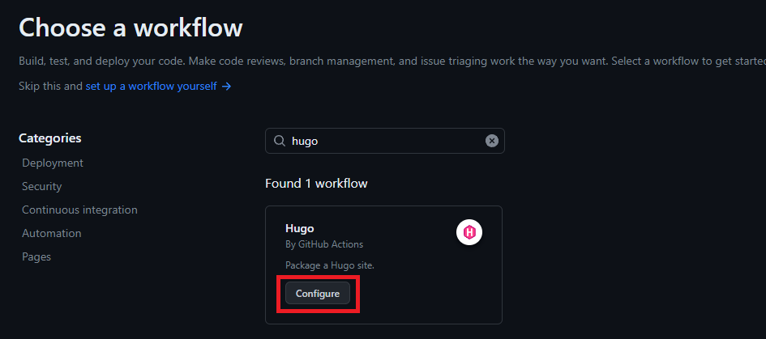

# Lesson: Getting Started with Hugo and GitHub Pages

## Introduction

In today's lesson, we'll explore the powerful static site generator, Hugo, and learn how to leverage GitHub Pages to host our Hugo-generated site. Whether you're a beginner or looking to advance your skills, this lesson will cover the essentials to get you started and take you to the next level.

## What is Hugo?

[Hugo](https://gohugo.io/) is a fast and flexible static site generator written in Go. It allows you to create websites with ease, providing a simple and efficient way to manage content. Unlike dynamic content management systems, Hugo generates static HTML files, making your site fast, secure, and easy to deploy.

## Setting Up Hugo

### Installation

1. Download Hugo from the [official website](https://gohugo.io/getting-started/installing/).
2. Follow the installation instructions for your operating system.

### Create a New Hugo Project

```bash
hugo new site myblog
cd myblog
```

### Choose a Theme

Hugo supports various themes. Choose one and add it to your configuration:

```bash
git init
git submodule add https://github.com/budparr/gohugo-theme-ananke.git themes/ananke
echo 'theme = "ananke"' >> hugo.toml
```

### Create Your First Content

```bash
hugo new posts/my-first-post.md
```

Edit the newly created Markdown file to add content.

## Advanced Hugo Usage

### Customizing Themes

1. Explore the theme's documentation.
2. Modify the theme's files in your project's `themes` directory to customize the layout and style.

### Shortcodes and Widgets

Enhance your content with [shortcodes](https://gohugo.io/content-management/shortcodes/) and interactive widgets.

### Taxonomies

Organize content with [taxonomies](https://gohugo.io/content-management/taxonomies/), such as tags and categories.

## Hosting with GitHub Pages

### Set Up GitHub Repository

1. Create a new repository on GitHub.
2. Push your Hugo project to the repository.

### Configure GitHub Actions

To configure the site to be published using GitHub Actions :

1. In GitHub, access your site's repository.
2. Under the name of your repository, click on Settings. If you don't see the « Settings » tab, select the drop-down menu, then click **Settings**.


3. In the « Code and automation » section of the sidebar, click on **Pages**.
4. Under « Build and deployment », under « Source », select GitHub Actions.


5. GitHub offers several startup workflows. You can simply click on **browse all workflows**, then search for **Hugo** and configure it.



GitHub Pages does not associate a specific workflow with GitHub Pages parameters. However, GitHub Pages settings are linked to the workflow that most recently deployed your site.

An example of what the `.github/workflows/hugo.yml` file would look like:

```yaml
name: Build and Deploy
on:
  push:
    branches:
      - main
jobs:
  deploy:
    runs-on: ubuntu-latest
    steps:
      - name: Checkout Repository
        uses: actions/checkout@v2
      - name: Setup Hugo
        uses: peaceiris/actions-hugo@v2
      - name: Build
        run: hugo --minify
      - name: Deploy to GitHub Pages
        uses: peaceiris/actions-gh-pages@v3
        with:
          publish_dir: ./public
          github_token: ${{ secrets.GITHUB_TOKEN }}
```

Your Hugo website is now online on GitHub Pages!
From now on, any changes you make to the main branch will automatically update your website's interface.