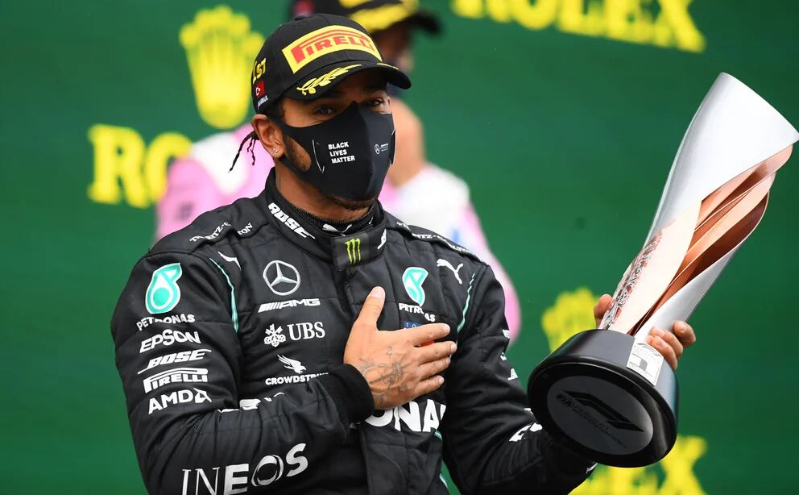

## Race Highlights

The 2020 Turkish Grand Prix at Istanbul Park on November 15 provided a spectacular showcase of racing on a challenging wet track. The rain added an extra layer of complexity, testing the drivers' skill and adaptability.

### Winner: Lewis Hamilton

> "These are the races you live for. The conditions were tough, but the team and I navigated it well. Proud of this win!" - Lewis Hamilton

Lewis Hamilton secured another victory, demonstrating his prowess in adverse weather conditions. The win further solidified his position at the top of the championship standings.

### Top 3 Finishers

| Position | Driver           | Team       |
| -------- | ---------------- | ---------- |
| 1        | Lewis Hamilton   | Mercedes   |
| 2        | Sergio Perez     | Racing Point |
| 3        | Sebastian Vettel | Ferrari    |

### Drama-Filled Race

The race was filled with drama as many drivers struggled to maintain control on the slippery surface. Multiple spins and position changes kept fans on the edge of their seats throughout the event.

### Podium Celebrations

The podium featured Hamilton, Sergio Perez, and Sebastian Vettel. The triumphant trio navigated the challenging conditions and celebrated their achievements on the iconic Istanbul Park podium.

## Memorable Moments

- Hamilton's masterful wet-weather driving
- Perez's impressive comeback
- Charles Leclerc's valiant effort

The Turkish Grand Prix showcased the unpredictable nature of Formula 1 and the skill required to conquer challenging weather conditions.

## Watch Race Highlights on YouTube
