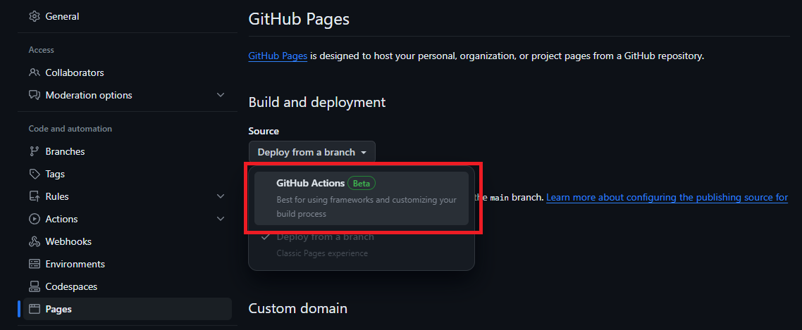
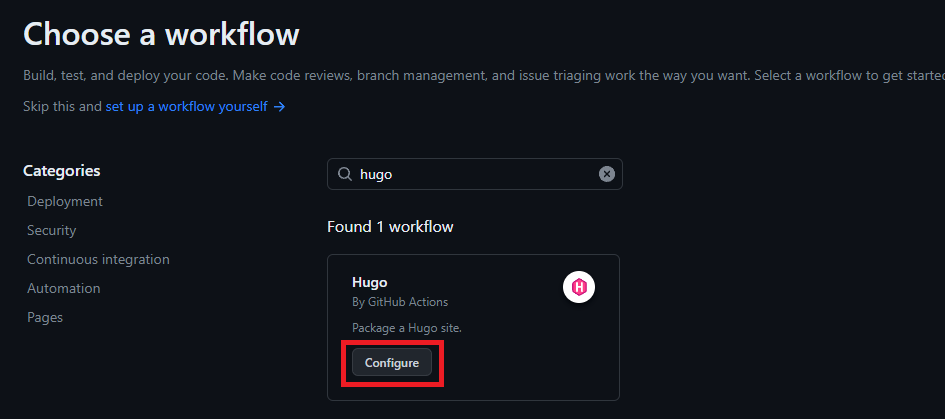

# Leçon : Introduction à Hugo et aux pages GitHub

[Hugo](cover.png)

## Introduction

Dans la leçon d'aujourd'hui, nous allons explorer le puissant générateur de sites statiques, Hugo, et apprendre à utiliser GitHub Pages pour héberger notre site généré par Hugo. Que vous soyez débutant ou que vous cherchiez à améliorer vos compétences, cette leçon couvrira les éléments essentiels pour vous permettre de démarrer et de passer au niveau supérieur.

## Qu'est-ce que Hugo ?

[Hugo](https://gohugo.io/) est un générateur de site statique rapide et flexible écrit en Go. Il vous permet de créer des sites web facilement, en fournissant un moyen simple et efficace de gérer le contenu. Contrairement aux systèmes de gestion de contenu dynamique, Hugo génère des fichiers HTML statiques, ce qui rend votre site rapide, sécurisé et facile à déployer.

## Installation de Hugo

### Installation

1. Téléchargez Hugo depuis le [site officiel] (https://gohugo.io/getting-started/installing/).
2. Suivez les instructions d'installation pour votre système d'exploitation.

### Créer un nouveau projet Hugo

```bash
hugo new site monblog
cd monblog
```

### Choisir un thème

Hugo supporte différents thèmes. Choisissez-en un et ajoutez-le à votre configuration :

```bash
git init
git submodule add https://github.com/budparr/gohugo-theme-ananke.git themes/ananke
echo 'theme = "ananke"' >> hugo.toml
```

### Créer votre premier contenu

```bash
hugo new posts/my-first-post.md
```

Editez le fichier Markdown nouvellement créé pour ajouter du contenu.

## Utilisation avancée d'Hugo

### Personnalisation des thèmes

1. Explorez la documentation du thème.
2. Modifiez les fichiers du thème dans le répertoire `themes` de votre projet pour personnaliser la mise en page et le style.

### Shortcodes et widgets

Améliorez votre contenu avec des [shortcodes] (https://gohugo.io/content-management/shortcodes/) et des widgets interactifs.

### Taxonomies

Organisez votre contenu avec des [taxonomies](https://gohugo.io/content-management/taxonomies/), telles que des étiquettes et des catégories.

## Hébergement avec GitHub Pages

### Configurer le dépôt GitHub

1. Créez un nouveau dépôt sur GitHub.
2. Pousser votre projet Hugo vers le dépôt.

### Configurer GitHub Actions

Pour configurer le site à publier avec GitHub Actions :

1. Dans GitHub, accédez au dépôt de votre site.
2. Sous le nom de votre dépôt, cliquez sur Paramètres. Si vous ne voyez pas l’onglet « Paramètres », sélectionnez le menu déroulant, puis cliquez sur **Paramètres**.


3. Dans la section « Code et automatisation » de la barre latérale, cliquez sur **Pages**.
4. Sous « Générer et déploiement », sous « Source », sélectionnez GitHub Actions.



5. GitHub propose plusieurs workflows de démarrage. Vous pouvez simplement cliquer sur **parcourir tous les flux de travail**, puis rechercher **Hugo** et le configurer.



GitHub Pages n’associe pas de workflow spécifique aux paramètres GitHub Pages. Toutefois, les paramètres GitHub Pages sont liés à l’exécution du workflow qui a déployé votre site le plus récemment.

Un exemple de ce à quoi le fichier `.github/workflows/hugo.yml` ressemblerait :

```yaml
name: Build and Deploy
on:
  push:
    branches:
      - main
jobs:
  deploy:
    runs-on: ubuntu-latest
    steps:
      - name: Checkout Repository
        uses: actions/checkout@v2
      - name: Setup Hugo
        uses: peaceiris/actions-hugo@v2
      - name: Build
        run: hugo --minify
      - name: Deploy to GitHub Pages
        uses: peaceiris/actions-gh-pages@v3
        with:
          publish_dir: ./public
          github_token: ${{ secrets.GITHUB_TOKEN }}
```

Votre site Hugo est maintenant en ligne sur GitHub Pages !
À présent, toute modification apportée à la branche principale entraînera la mise à jour automatique de l'interface de votre site web.