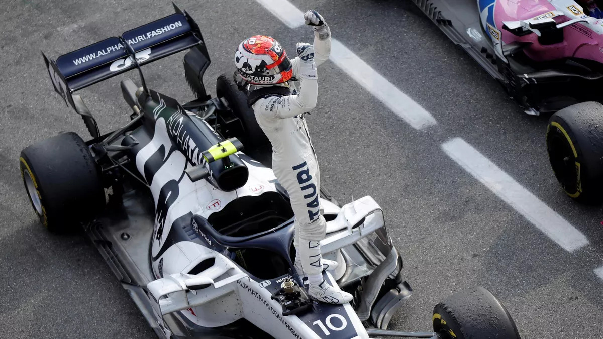

## Moments Forts de la Course

Le Grand Prix d'Italie 2020 à Monza a été un spectacle palpitant rempli de rebondissements inattendus et de compétition intense. Tenue le 6 septembre, la course a offert de l'excitation de bout en bout.

### Vainqueur : Pierre Gasly

> "C'est un rêve qui se réalise ! L'équipe a fait un travail incroyable, et je suis tellement fier de ce que nous avons accompli ensemble." - Pierre Gasly

Dans un retournement de situation surprenant, Pierre Gasly d'AlphaTauri a remporté la victoire, assurant sa première victoire en Formula 1. Sa performance exceptionnelle et sa conduite stratégique ont captivé les fans du monde entier.

### Top 3 Finishers

| Position | Driver           | Team          |
| -------- | ---------------- | ------------  |
| 1        | Pierre Gasly     | AlphaTauri    |
| 2        | Carlos Sainz     | McLaren       |
| 3        | Lance Stroll     | Racing Point  |

### Drame chez Mercedes

La course a connu un drame sans précédent chez Mercedes alors que Lewis Hamilton et Valtteri Bottas ont été confrontés à des défis. Les deux pilotes ont rencontré des problèmes, ouvrant la voie aux équipes du milieu de tableau pour briller.

### Célébrations sur le Podium

Les célébrations sur le podium étaient inoubliables, avec Gasly accompagné de Carlos Sainz et Lance Stroll. L'hymne national français résonnait à travers Monza alors que Gasly se tenait fièrement au sommet du podium.

## Moments Mémorables

- Les dépassements incroyables de Gasly
- La charge vers le podium de Daniel Ricciardo
- Un incident chaotique dans la voie des stands

Ce Grand Prix d'Italie restera dans les mémoires comme l'une des courses les plus imprévisibles et passionnantes de la saison 2020.

## Regardez les moments forts de la course sur YouTube
