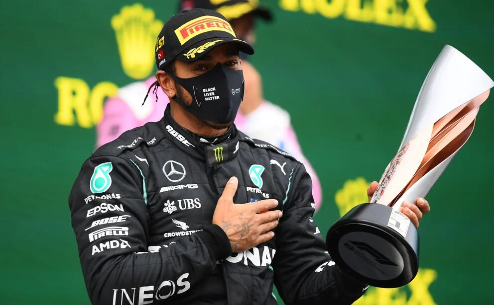

## Moments forts de la course

Le Grand Prix de Turquie 2020 à Istanbul Park le 15 novembre a offert un spectacle spectaculaire de courses sur une piste mouillée et difficile. La pluie a ajouté une couche supplémentaire de complexité, testant les compétences et l'adaptabilité des pilotes.

### Vainqueur : Lewis Hamilton

> "Ce sont les courses pour lesquelles vous vivez. Les conditions étaient difficiles, mais l'équipe et moi les avons bien gérées. Fier de cette victoire !" - Lewis Hamilton

Lewis Hamilton a remporté une autre victoire, démontrant sa maîtrise des conditions météorologiques difficiles. La victoire a solidifié davantage sa position en tête du classement du championnat.

### Les 3 premiers

| Position | Pilote           | Équipe        |
| -------- | ---------------- | ------------- |
| 1        | Lewis Hamilton   | Mercedes      |
| 2        | Sergio Perez     | Racing Point  |
| 3        | Sebastian Vettel | Ferrari       |

### Course pleine de rebondissements

La course a été remplie de rebondissements alors que de nombreux pilotes ont du mal à maintenir le contrôle sur la surface glissante. Des tours en tête et des changements de position ont maintenu les fans en haleine tout au long de l'événement.

### Célébrations sur le podium

Le podium a mis en vedette Hamilton, Sergio Perez et Sebastian Vettel. Le trio triomphant a navigué dans des conditions difficiles et a célébré ses réalisations sur le podium emblématique d'Istanbul Park.

## Moments mémorables

- La conduite magistrale de Hamilton par temps humide
- La remarquable remontée de Perez
- L'effort vaillant de Charles Leclerc

Le Grand Prix de Turquie a montré la nature imprévisible de la Formula 1 et les compétences nécessaires pour surmonter des conditions météorologiques difficiles.

## Regardez les moments forts de la course sur YouTube
